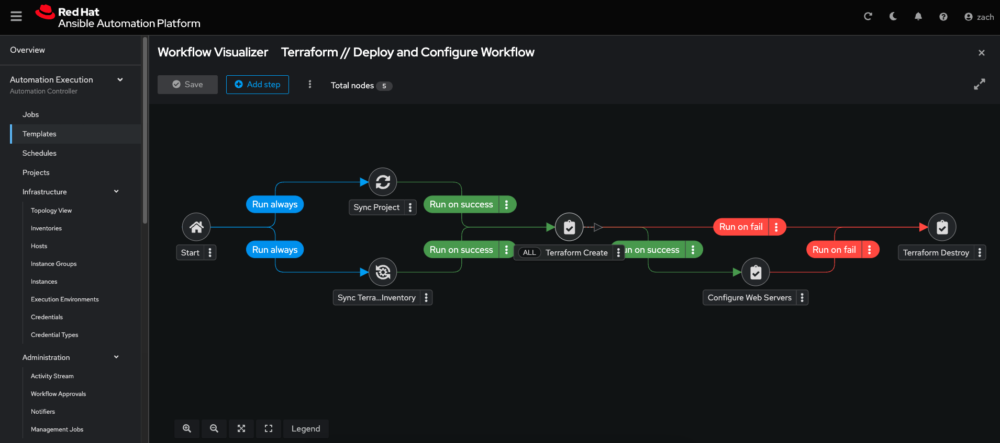

# Create Web Demo

This Terraform project contains the configurations required to deploy two Azure Virtual Machines which will serve as managed Ansible nodes to be configured as web servers.

- [Providers](./providers.tf)
- [Variables](./variables.tf)
- [Main](./main.tf)

## Terraform

### Resources

The infrastructure is pretty simple:
- basic Azure networking resources
- security rules to allow for SSH (not production grade)
- a couple of vms
- ssh key pair

Lookup **source_image_reference** configurations for VMs using the Azure CLI:<br>
`az vm image list --publisher RedHat --all --output table`

### Important Variables

| Variable | Purpose |
| --- | --- |
| az_resource_group | Target resource group |
| az_region | Azure region for the resource group / infrastructure |
| web_tags_base | Base tags for resources deploy - I **always** recommend tags |
| web_* | Other variables for standardized naming of deployed resources |

## Ansible Playbook

Playbooks included support executing Terraform operations via Ansible and configuration of the provisioned infrastructure. The complete product is a Workflow Job Template in Ansible Automation Platform which chains together the execution of the playbooks.

| Playbook | Description |
| --- | --- |
| [tf_ops.yml](./ansible/tf_ops.yml) | Based on tags, will either complete the `terraform apply` or `terraform destroy` action |

## AAP Workflow

To tie everything together in an enterprise-grade workflow, you will need to create a few resources in Ansible Automation Platform. Below is a list of the resources I created and relationships between them. The configuration results in a workflow pictured immediately below:



```yaml
# projects.yml
---
controller_projects:
  - name: Terraform Mgmt
    scm_url: https://github.com/zjleblanc/ansible-terraform.git
    organization: Autodotes
    scm_branch: master
    scm_type: git
```

```yaml
# execution_environments.yml
---
controller_execution_environments:
  - name: ee-default
    description: my default execution environment with all the collections and libraries \
    image: quay.io/zleblanc/ee-default:87a71cbb
  - name: ee-cloud
    description: Scott Harwell's Cloud EE hosted in quay
    image: quay.io/scottharwell/cloud-ee

```

```yaml
# credentials.yml
---
controller_credentials:
- name: AAP (id_rsa)
  organization: Autodotes
  description: SSH credential for connecting as zach user
  credential_type: Machine
  inputs:
    become_method: ''
    become_username: ''
    ssh_key_data: "{{ controller_credential_ansible_ssh_key }}"
    username: zach
- name: Terraform Backend Azure Storage Credential
  description: Terraform backend configuration for Azure storage account in your Azure subscription
  organization: Autodotes
  credential_type: Terraform backend configuration
  inputs:
    configuration: |
      resource_group_name  = "openenv-jmdmt"
      storage_account_name = "zjltfstatemgmtsa"
      container_name       = "tfstate"
      access_key           = "{{ controller_credential_az_tf_backend_key  }}"
- name: Azure RM Service Principal
  description: service principal with perms to deploy in your Azure subscription
  organization: Autodotes
  credential_type: Microsoft Azure Resource Manager
  inputs:
    client: "{{ controller_credential_azure_client }}"
    secret: "{{ controller_credential_azure_secret }}"
    subscription: "{{ controller_credential_azure_subscription }}"
    tenant: "{{ controller_credential_azure_tenant }}"
```

```yaml
# job_templates.yml
---
controller_templates:
- name: Terraform // Web Demo Deploy
  description: Deploy web demo to Azure using terraform modules
  labels:
    - Demo
  project: Terraform Mgmt
  organization: Autodotes
  inventory: Ansible-Terraform Inventory
  playbook: create_web_demo/ansible/tf_ops.yml
  execution_environment: ee-cloud
  credentials:
    - Azure RM Service Principal
    - Terraform Backend Azure Storage Credential
  ask_tags_on_launch: true
  survey_spec:
    name: job template survey
    description: SSH cred for bootstrapping VM
    spec:
    - question_name: SSH Public Key
      question_description: SSH public key which will enable configuration after provisioning
      max: 1024
      min: 0
      required: true
      type: password
      variable: az_ssh_pubkey
- name: Terraform // Web Demo Configure
  description: Configure webservers provisioned by Terraform
  labels:
    - Demo
  project: Terraform Mgmt
  organization: Autodotes
  inventory: Ansible-Terraform Inventory
  playbook: create_web_demo/ansible/configure_web.yml
  execution_environment: ee-default
  credentials:
    - AAP (id_rsa)
```

```yaml
# workflow_job_templates.yml
---
controller_workflows:
- name: Terraform // Deploy and Configure Workflow
  organization: Autodotes
  survey_enabled: true
  survey_spec:
    name: workflow survey
    description: SSH public key passthrough
    spec:
    - question_name: SSH Public Key
      question_description: SSH public key which will enable configuration after provisioning
      max: 1024
      min: 0
      required: true
      type: password
      variable: az_ssh_pubkey
  workflow_nodes:
  - identifier: Sync Project
    related:
      success_nodes:
      - identifier: Terraform Create
    unified_job_template:
      name: Terraform Mgmt
      organization:
        name: Autodotes
        type: organization
      type: project
  - identifier: Sync Terraform Inventory
    related:
      success_nodes:
      - identifier: Terraform Create
    unified_job_template:
      inventory:
        name: Ansible-Terraform Inventory
        organization:
          name: Autodotes
          type: organization
        type: inventory
      name: openenv-jmdmt
      type: inventory_source
  - identifier: Terraform Create
    all_parents_must_converge: true
    related:
      failure_nodes:
      - identifier: Terraform Destroy
      success_nodes:
      - identifier: Configure Web Servers
    unified_job_template:
      name: Terraform // Web Demo Deploy
      organization:
        name: Autodotes
        type: organization
      type: job_template
  - identifier: Configure Web Servers
    related:
      failure_nodes:
      - identifier: Terraform Destroy
    unified_job_template:
      name: Terraform // Web Demo Configure
      organization:
        name: Autodotes
        type: organization
      type: job_template
  - identifier: Terraform Destroy
    job_tags: remove
    unified_job_template:
      name: Terraform // Web Demo Deploy
      organization:
        name: Autodotes
        type: organization
      type: job_template

```

## Lessons Learned

Authentication
- Terraform azurerm provider expects **ARM_\*** environment variables to handle login via az client
- Microsoft Azure Resource Manager Credential Type injects **AZURE_\*** - you must map these in a playbook (or use custom cred type)
- Terraform azurerm backend has multiple auth options, I was using a storage account key
  - there are two parameters for the backend that confused me: `key` and `access_key`
  - `key` is required and is used to name the folder in blob storage used for the projects state
  - `access_key` is used to authenticate with the storage account, can be supplied via ARM_ACCESS_KEY
- Built-in Credential Type **Terraform backend configuration** supports injecting the `TF_BACKEND_CONFIG_FILE` environment variable which can be passed to the **cloud.terraform.terraform** module
  - I put my access_key into this _encrypted_ credential. It could also be source from a third-party vault for additional security.
  - You could create a custom credential type to inject all of the **ARM_\*** environment variables needed for your use case, and it may even be cleaner if used often. I chose to show it as raw as possible so readers could see the details and clean it up as desired.